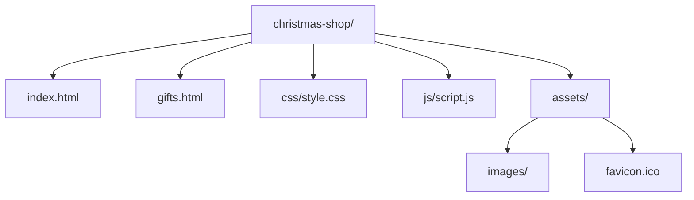
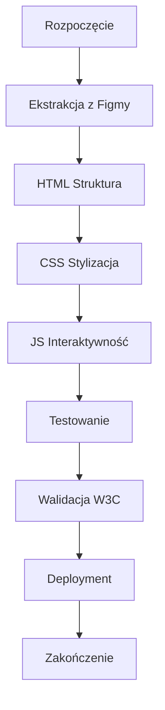
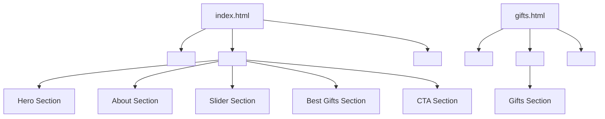
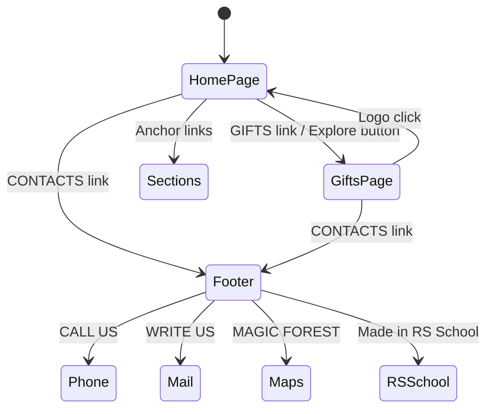
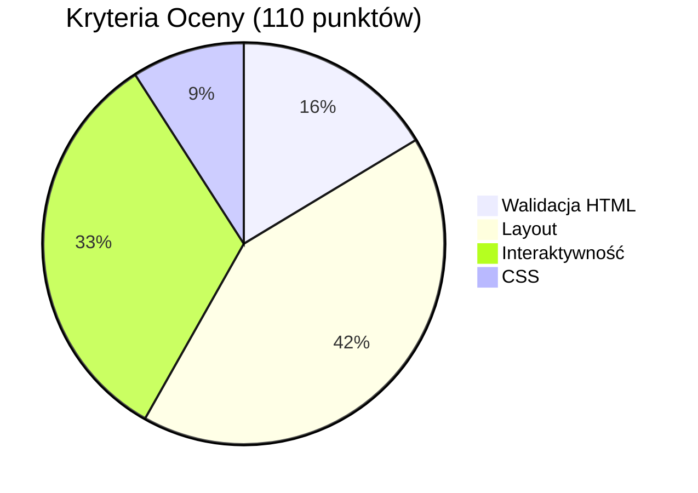

# Plan Implementacji: Christmas Shop (Druga Wersja)

## Cel Projektu
Stworzenie dwóch stron internetowych (Home i Gifts) o stałej szerokości 1440px, zgodnych z projektem z Figmy, z pełną interaktywnością i walidacją W3C.

## Struktura Projektu
```
christmas-shop/
├── index.html          # Strona główna (Home)
├── gifts.html          # Strona prezentów (Gifts)
├── css/
│   └── style.css       # Wszystkie style CSS
├── js/
│   └── script.js       # Logika JavaScript
└── assets/             # Obrazy, favicon
    ├── images/
    └── favicon.ico
```

## Diagram Struktury Projektu


## Etapy Implementacji

### 1. Przygotowanie Środowiska
- Utwórz strukturę folderów
- Skopiuj dane z Figmy (kolory, czcionki, wymiary)
- Przygotuj obrazy i favicon

### 2. Budowa HTML
- **index.html (Home page):**
  - Header z nawigacją
  - Hero section
  - About section
  - Slider section
  - Best Gifts section (Flexbox/Grid)
  - CTA section
  - Footer

- **gifts.html (Gifts page):**
  - Header z nawigacją
  - Gifts section (grid z kartami)
  - Footer

### 3. Stylizacja CSS
- Layout 1440px, wycentrowany
- Responsywność (>1440px centered, <100% zoom)
- Hover effects z smooth transitions

### 4. Interaktywność JavaScript
- Nawigacja zakotwiczeniowa
- Linki między stronami
- Akcje w footer (tel, mail, maps, RS link)

### 5. Testowanie i Walidacja
- W3C HTML validation
- Layout match z PerfectPixel
- Testy interaktywności

### 6. Deployment
- Branch christmas-shop
- PR do gh-pages i main

## Diagram Przepływu Implementacji


## Struktura HTML (Diagram)


## Diagram Interaktywności


## Checklist Ekstrakcji z Figmy
- [ ] Kolory (hex values)
- [ ] Czcionki (family, size, weight)
- [ ] Wymiary (szerokość, wysokość, padding)
- [ ] Obrazy (logo, karty, ikony)
- [ ] Hover effects
- [ ] Copy as code dla sekcji

## Kryteria Oceny (110 punktów)
- **Walidacja HTML**: 18 punktów (6 na stronę)
- **Layout zgodny z projektem**: 46 punktów
- **Interaktywność**: 36 punktów
- **CSS**: 10 punktów

## Diagram Kryteriów Oceny


## Notatki Dodatkowe
- Użyj czystego HTML/CSS/JS bez frameworków
- Layout wycentrowany przy >1440px, białe tło
- Smooth transitions dla hover effects
- Jeden <h1> na stronę
- Favicon na obu stronach
- URLs: / dla Home, /gifts dla Gifts
