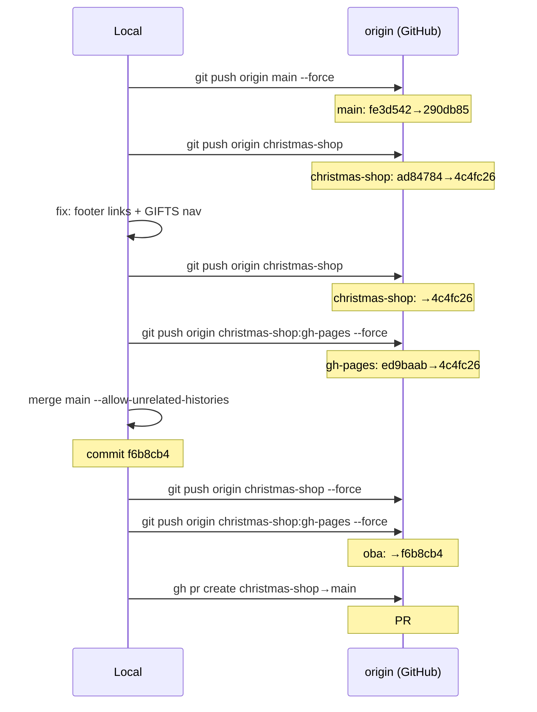
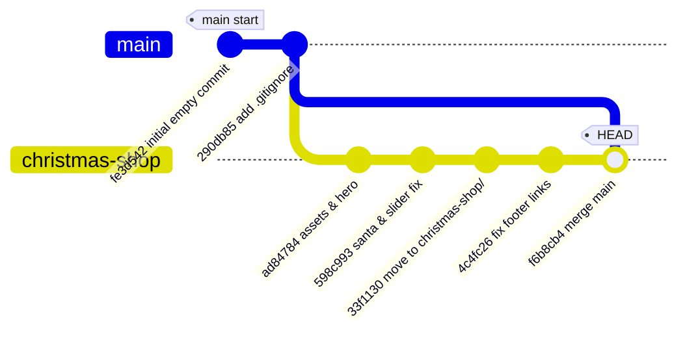
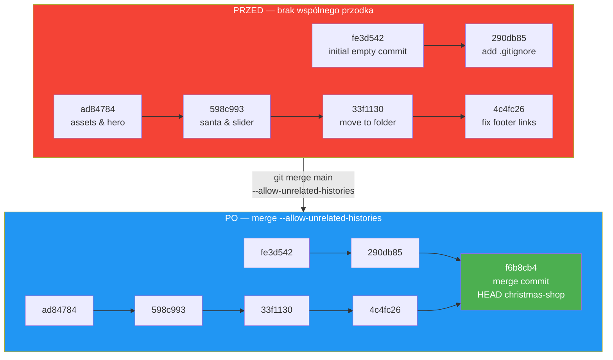
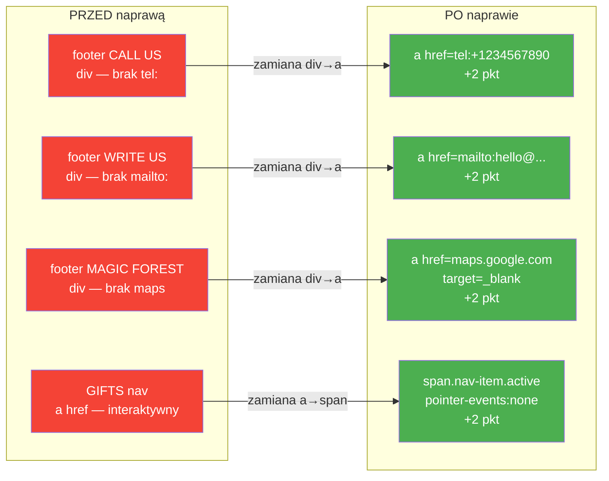

# Deploy i Pull Request — Christmas Shop

## Kontekst
Po zakończeniu kodu lokalnego trzeba było:
1. Dodać remote origin (repo szkoły)
2. Wypchnąć branche na GitHub
3. Naprawić brakującą interaktywność (footer, nav)
4. Wdrożyć na gh-pages
5. Otworzyć PR do `main` do oceny

---

## Chronologia działań

### 1. Dodanie remote origin

```bash
git remote add origin https://github.com/rolling-scopes-school/alankowalzky-JSFEPRESCHOOL2026Q1.git
```

Sprawdzenie co jest na zdalnym repo:

```bash
git fetch origin
git log origin/main --oneline
# ed9baab Initial commit
```

Zdalne `main` miało tylko jeden automatyczny commit szkoły (`ed9baab`).
Lokalne `main` miało 2 własne commity — **niezgodne historie**.

---

### 2. Push obu branchy

```bash
git push origin main --force
# + ed9baab...290db85 main -> main (forced update)

git push origin christmas-shop
# * [new branch] christmas-shop -> christmas-shop
```

Force push na `main` był bezpieczny — nadpisał tylko pusty commit szkoły.

---

### 3. Naprawa interaktywności (CrossCheck)

Zidentyfikowane braki punktowe:

| Problem | Punkty |
|---|---|
| Footer CALL US — brak `href="tel:"` | +2 |
| Footer WRITE US — brak `href="mailto:"` | +2 |
| Footer MAGIC FOREST — brak Google Maps | +2 |
| GIFTS nav na gifts.html — nadal `<a>` (powinien być nieinteraktywny) | +2 |

**Zmiany w `index.html` i `gifts.html`** — karty footer zamienione z `<div>` na `<a>`:

```html
<!-- PRZED -->
<div class="footer-card" tabindex="0">...</div>

<!-- PO -->
<a href="tel:+1234567890" class="footer-card">...</a>
<a href="mailto:hello@christmas.shop" class="footer-card">...</a>
<a href="https://maps.google.com/?q=Central+Park,New+York"
   target="_blank" rel="noopener noreferrer" class="footer-card">...</a>
```

**Zmiana w `gifts.html`** — GIFTS w nav jako `<span>` (nieinteraktywny):

```html
<!-- PRZED -->
<a href="gifts.html" class="nav-item active">...</a>

<!-- PO -->
<span class="nav-item active">...</span>
```

**Zmiana w `style.css`** — dodano `text-decoration: none; color: inherit;` do `.footer-card` oraz styl dla `span.nav-item`.

Commit i push:

```bash
git add christmas-shop/index.html christmas-shop/gifts.html christmas-shop/css/style.css
git commit -m "fix: footer cards as links (tel/mailto/maps), GIFTS nav non-interactive on gifts page"
git push origin christmas-shop
# 33f1130..4c4fc26 christmas-shop -> christmas-shop
```

---

### 4. Wdrożenie na gh-pages

```bash
git push origin christmas-shop:gh-pages --force
# + ed9baab...4c4fc26 christmas-shop -> gh-pages (forced update)
```

Strona dostępna pod:
```
https://rolling-scopes-school.github.io/alankowalzky-JSFEPRESCHOOL2026Q1/christmas-shop/
```

---

### 5. Problem z PR — brak wspólnej historii

Próba utworzenia PR przez `gh`:

```bash
gh pr create --base main --head christmas-shop ...
# pull request create failed: GraphQL: The christmas-shop branch
# has no history in common with main (createPullRequest)
```

**Przyczyna**: `main` i `christmas-shop` były orphan branches — dwa osobne drzewa bez wspólnego przodka. GitHub blokuje PR między nimi.

```
main:           fe3d542 --- 290db85
                                        (brak połączenia)
christmas-shop: ad84784 --- 598c993 --- 33f1130 --- 4c4fc26
```

---

### 6. Naprawa historii — merge z allow-unrelated-histories

**Krok 1 — backup tag:**
```bash
git tag backup-christmas-shop-before-merge 4c4fc26
```

**Krok 2 — stash niezacommitowanych zmian:**
```bash
git stash push -m "backup uncommitted changes before merge"
# Saved working directory and index state On christmas-shop: backup...
```

**Krok 3 — merge main do christmas-shop:**
```bash
git merge main --allow-unrelated-histories --no-edit \
  -m "chore: merge main into christmas-shop to establish common history"
# Merge made by the 'ort' strategy.
# .gitignore | 6 ++++++
# .gitkeep   | 1 +
# 2 files changed, 7 insertions(+)
```

**Krok 4 — weryfikacja grafu:**
```bash
git log --oneline --graph --all
#   f6b8cb4 chore: merge main into christmas-shop to establish common history
# |\ 
# | * 290db85 chore: add .gitignore with mermaid exclusions
# | * fe3d542 chore: initial empty commit
# * 4c4fc26 fix: footer cards as links...
# * 33f1130 feat: move all project files...
# * 598c993 feat: Santa in about section...
# * ad84784 feat: add assets, festive backgrounds...
```

**Krok 5 — force push:**
```bash
git push origin christmas-shop --force
# 4c4fc26..f6b8cb4 christmas-shop -> christmas-shop

git push origin christmas-shop:gh-pages --force
# 4c4fc26..f6b8cb4 christmas-shop -> gh-pages
```

**Krok 6 — PR przez gh CLI:**
```bash
gh pr create \
  --base main \
  --head christmas-shop \
  --title "Christmas Shop. Part-1 - Fixed Layout" \
  --body "..." \
  --repo rolling-scopes-school/alankowalzky-JSFEPRESCHOOL2026Q1
# https://github.com/rolling-scopes-school/alankowalzky-JSFEPRESCHOOL2026Q1/pull/1
```

**Krok 7 — przywrócenie stash:**
```bash
git stash pop
# Dropped refs/stash@{0}
```

---

## Stan końcowy

| Branch | Commit HEAD | Zawartość |
|---|---|---|
| `main` | `290db85` | `.gitkeep` + `.gitignore` |
| `christmas-shop` | `f6b8cb4` | projekt + merge commit |
| `gh-pages` | `f6b8cb4` | identyczny z christmas-shop |

PR #1: https://github.com/rolling-scopes-school/alankowalzky-JSFEPRESCHOOL2026Q1/pull/1
— **NIE mergować** (do oceny przez szkołę)

---

## Diagramy

### Przepływ zdalnych operacji



### Historia commitów po merge



### Problem i rozwiązanie — brak wspólnej historii



### Naprawione punkty CrossCheck



### Zabezpieczenie przed utratą danych

```mermaid
stateDiagram-v2
    [*] --> StanWyjściowy: 4c4fc26 na christmas-shop

    StanWyjściowy --> TagBackup: git tag backup-christmas-shop-before-merge
    TagBackup --> Stash: git stash push -m "backup..."
    Stash --> Merge: git merge main --allow-unrelated-histories
    Merge --> PushForce: git push --force (christmas-shop + gh-pages)
    PushForce --> PRUtworzony: gh pr create → PR #1
    PRUtworzony --> StashPop: git stash pop
    StashPop --> [*]: Stan końcowy f6b8cb4

    note right of TagBackup: Punkt przywrócenia:\ngit checkout backup-christmas-shop-before-merge
    note right of Stash: Odzyskanie:\ngit stash pop
```
